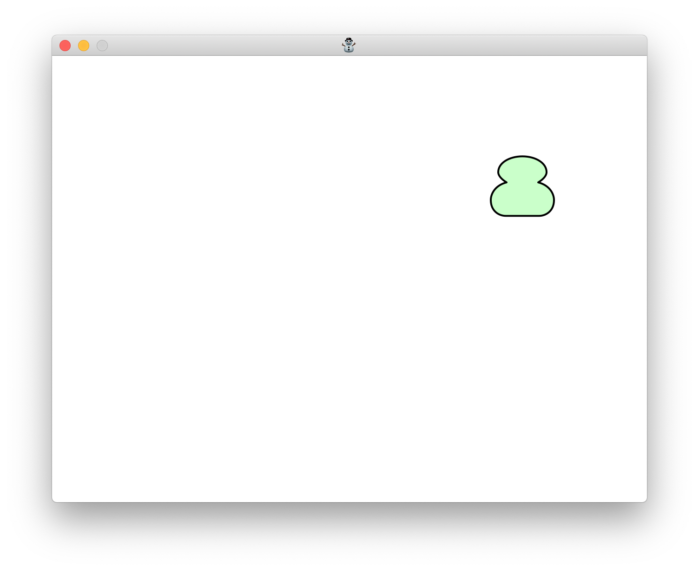

# sdl2-cairo-omochi
A bouncing omochi (This is an example program for [SDL2](https://www.libsdl.org) and [cairo](https://www.cairographics.org)).

## Build
```sh
make
```

## Usage
```sh
./sdl2-cairo-omochi
```

## Screenshot


## Platform
SDL2 is a cross-platform library.
It is confirmed that `sdl2-cairo-omochi` runs on following platforms:

- Ubuntu
- macOS
- MSYS2 + MinGW-w64 (Windows 10)

## Helpful Links
- https://cairographics.org/SDL/
- https://cairographics.org/samples/
- https://github.com/rozaxe/ex-harfbuzz-sdl2-cairo-freetype-emoji
- https://stackoverflow.com/questions/24316393/can-cairo-use-sdl-texture-as-a-render-target
